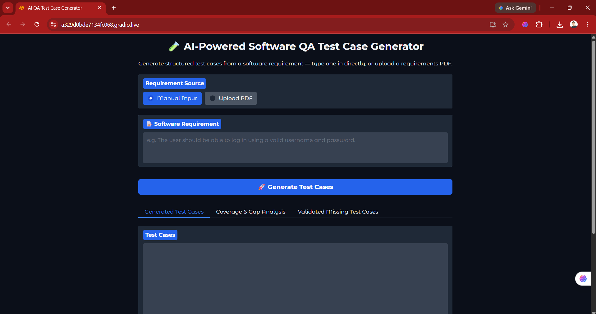
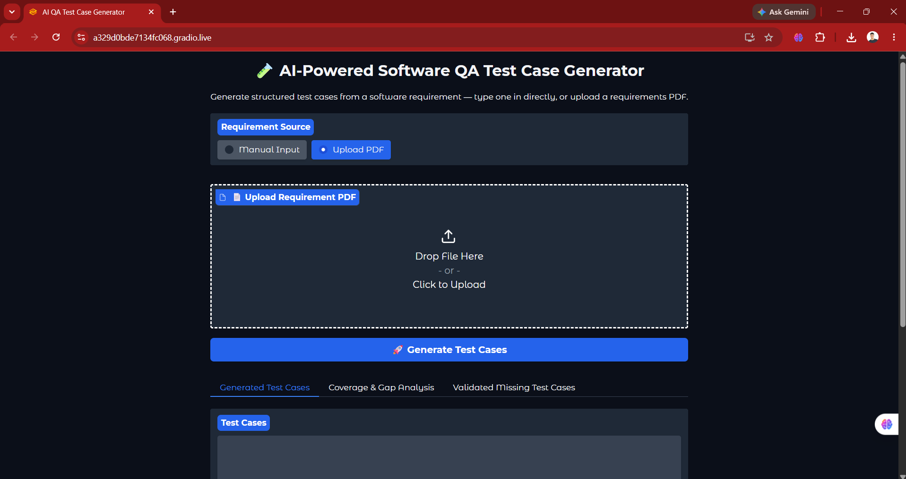
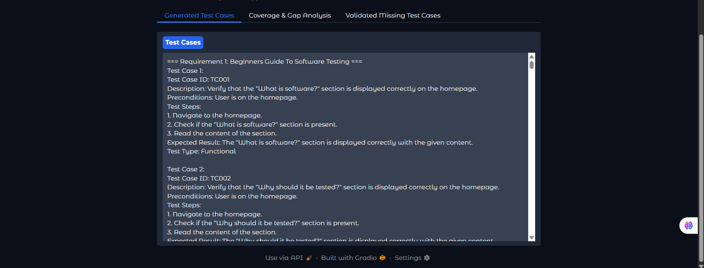
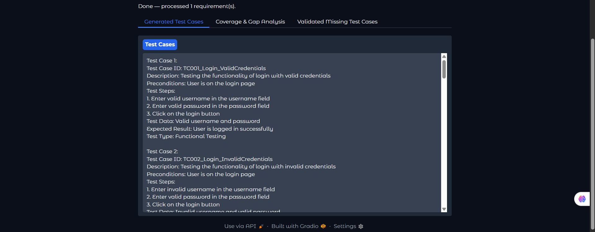
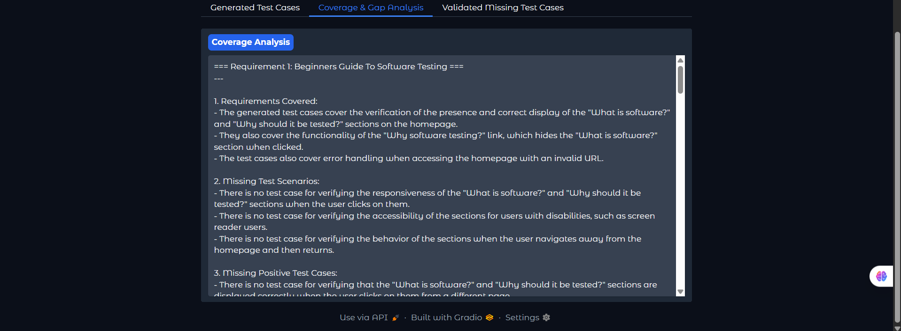
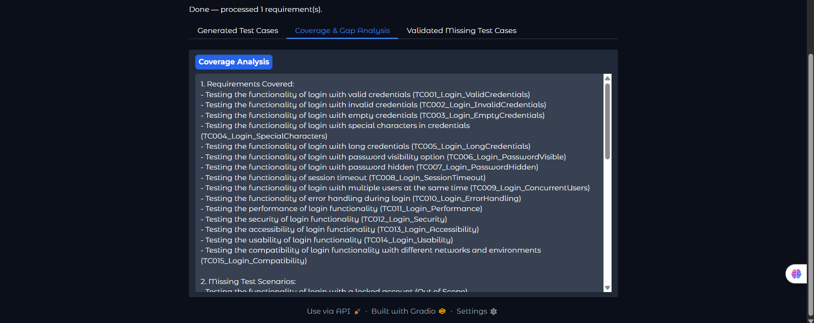
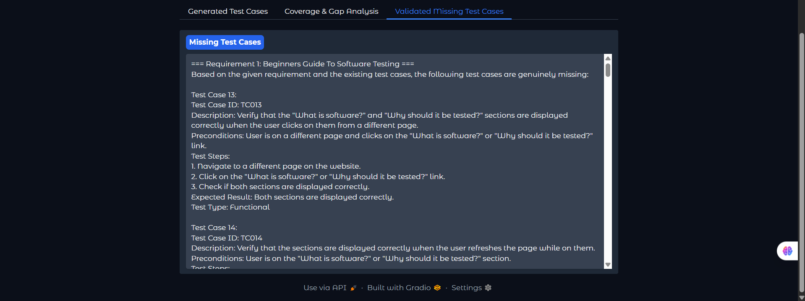
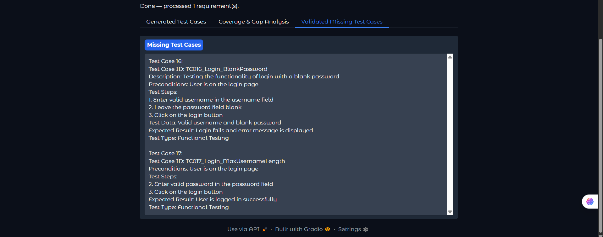

# 🚀 Tips Hindawi Challenge (June–July) 2026

> 🏆 This repository is my official submission for the [ **Tips Hindawi** ](https://www.tipshindawi.com/) **Challenge (June–July) 2026**.

## 👤 Participant

| Field            | Value                                      |
| ---------------- | ------------------------------------------ |
| Full Name        | Ali Mohamed Abdelsalam                     |
| Project Name     | AI-Powered Software QA Test Case Generator |
| GitHub Username  | Ali-Mohamed-Abdelsalam                     |
| Challenge Batch  | June–July 2026                             |
| Training Program | Large Language Models (LLMs) Program       |
| Organization     | Edrak for Ai                               |

---

## 📖 Project Overview

This project is an AI-powered Software QA Test Case Generator that automatically generates software test cases from software requirements using Large Language Models (LLMs) and Retrieval-Augmented Generation (RAG).

The system uses the **Mistral-7B-Instruct-v0.2** Large Language Model to generate relevant software test cases based on a given requirement. A reference PDF containing software testing knowledge is used as a knowledge base within the RAG pipeline.

The PDF content is processed, divided into text chunks, converted into embeddings using the **all-MiniLM-L6-v2** embedding model, and stored in a **FAISS** vector database. When a user provides a software requirement, the system retrieves relevant testing knowledge from the knowledge base and provides it as context to the LLM.

The system generates different types of test scenarios, including **positive, negative, and edge-case test cases**. It then performs a coverage and gap analysis to identify potentially missing scenarios. Additional test cases are generated for identified gaps, validated against the original requirement, and filtered to reduce out-of-scope suggestions.

The project also provides an interactive **Gradio** interface where users can enter software requirements and view the generated test cases, coverage and gap analysis, and validated missing test cases.

---

## ✨ Features

* Automatically generate software QA test cases from plain-text software requirements.
* Use **Mistral-7B-Instruct-v0.2** for AI-powered test case generation.
* Generate positive, negative, and edge-case test scenarios.
* Use Retrieval-Augmented Generation (RAG) to provide relevant QA knowledge to the LLM.
* Use a software testing reference PDF as the project's QA knowledge base.
* Extract and process text from the reference PDF.
* Split the document into text chunks for retrieval.
* Generate semantic embeddings using **all-MiniLM-L6-v2**.
* Store and retrieve document embeddings using **FAISS** vector search.
* Perform coverage and gap analysis on generated test cases.
* Identify potentially missing testing scenarios.
* Generate additional test cases for identified coverage gaps.
* Validate generated missing test cases against the original software requirement.
* Apply a final filtering step to reduce out-of-scope suggestions.
* Use Pydantic for structured test case schemas and structured outputs.
* Provide an interactive Gradio interface for entering requirements and viewing results.
* Display generated test cases, coverage and gap analysis, and validated missing test cases.

---

## 🛠️ Technologies Used

* **Python** – Main programming language used to develop the project.
* **PyTorch** – Used for deep learning model execution and GPU-based inference.
* **Hugging Face Transformers** – Used to load and run the Mistral-7B-Instruct-v0.2 model.
* **Hugging Face Hub** – Used for model authentication and access.
* **Mistral-7B-Instruct-v0.2** – Main Large Language Model used for test case generation.
* **LangChain** – Used to build the RAG pipeline and manage document processing and retrieval components.
* **PyPDF** – Used to extract text from the reference PDF.
* **LangChain Text Splitters** – Used to split extracted document content into text chunks.
* **Sentence-Transformers** – Used to generate semantic embeddings.
* **all-MiniLM-L6-v2** – Used as the embedding model for the QA knowledge base.
* **FAISS** – Used for vector storage and similarity search.
* **Pydantic** – Used for structured test case schemas and parsing structured outputs.
* **Gradio** – Used to build the interactive web interface.
* **Kaggle Notebooks** – Used as the development and execution environment.
* **Tesla T4 GPU** – Used for GPU-accelerated model inference.

---

## ⚙️ Installation

The project was developed and tested in a **Kaggle Notebook** environment using GPU acceleration.

To run the project:

1. Open the project notebook in Kaggle.
2. Enable GPU acceleration from the notebook settings.
3. Install the required Python libraries using the installation cell in the notebook.
4. Authenticate with Hugging Face using a valid Hugging Face access token.
5. Make sure the reference PDF is available at the configured path.
6. Run the notebook cells in the correct order.
7. Launch the Gradio interface to interact with the test case generator.

The main required libraries include:

```text
langchain
langchain-core
langchain-community
langchain-huggingface
langchain-text-splitters
pypdf
faiss-cpu
sentence-transformers
gradio
transformers
torch
pydantic
huggingface_hub
```

---
🚀 Usage

The project accepts a plain-text software requirement as input.

For example:

```
The user should be able to log in using a valid username and password.
```

The system processes the requirement through the following workflow:

1-Loads and processes the reference software testing PDF.
2-Splits the extracted content into text chunks.
3-Generates embeddings using all-MiniLM-L6-v2.
4-Stores the embeddings in a FAISS vector database.
5-Accepts a software requirement from the user.
6-Retrieves relevant QA knowledge from the FAISS vector database.
7-Combines the retrieved knowledge with the original requirement.
8-Provides the context to the Mistral-7B-Instruct-v0.2 model.
9-Generates positive, negative, and edge-case test cases.
10-Performs coverage and gap analysis.
11-Generates additional test cases for identified missing scenarios.
12-Validates the missing test cases against the original requirement.
13-Applies final filtering to reduce out-of-scope suggestions.
14-Displays the final results through the Gradio interface.

The main outputs provided by the interface are:

*Generated Test Cases
*Coverage & Gap Analysis
*Validated Missing Test Cases

---

## 📸 Demo

The following screenshots demonstrate the AI-powered QA Test Case Generation Agent and its main outputs.

### AI QA Test Case Generation Agent





### Generated Test Cases

The agent generates structured software test cases based on the provided software requirement.





### Coverage & Gap Analysis

The agent analyzes the generated test cases to identify covered scenarios and potential coverage gaps.





### Missing Test Cases

The agent generates and presents additional test cases for identified missing scenarios.






---

📈Results

The project successfully demonstrates an AI-assisted software QA workflow that can generate software test cases from software requirements and improve test coverage through multiple analysis and validation stages.

The system combines LLM-based test case generation with Retrieval-Augmented Generation, semantic vector search, coverage and gap analysis, missing test case generation, requirement-based validation, and final filtering.

The generated test cases can be reviewed based on:

*Relevance to the original software requirement.
*Coverage of positive scenarios.
*Coverage of negative scenarios.
*Coverage of edge-case scenarios.
*Identification of potentially missing scenarios.
*Relevance of generated missing test cases.
*Ability to reduce unsupported or out-of-scope suggestions.

The project demonstrates the potential of combining Large Language Models with QA knowledge retrieval and validation techniques to support software testing activities and reduce the manual effort required for test case design.

---

🔮 Future Improvements

*Expand the QA knowledge base with additional software testing documents and resources.
*Improve the retrieval process by experimenting with different embedding models and retrieval strategies.
*Improve the coverage and gap analysis process.
*Replace keyword-based filtering with more advanced semantic or model-based relevance validation.
*Improve duplicate detection between generated and missing test cases.
*Add automatic export of generated test cases to Excel or CSV files.
*Integrate generated test cases with test management tools.
*Add support for processing multiple software requirements at once.
*Add support for complete requirements documents.
*Experiment with larger or more capable Large Language Models.
*Develop automated evaluation datasets for systematic assessment of generated test case quality.

---

📚About the Challenge

This project was developed as part of the Tips Hindawi Challenge (June–July) 2026.

Tips Hindawi is the internships department of Edrak for Ai, and the challenge encourages participants to build real-world projects, apply practical skills, and showcase their work through GitHub.

For more information about the challenge, training programs, and upcoming batches, visit the official Tips Hindawi website.


---

📄 License

This project is shared for educational and portfolio purposes.
